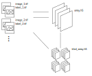

[](https://www.dlr.de/eoc/en/desktopdefault.aspx/tabid-5413/10560_read-21914/) UKIS_sat2h5
=======================================

`ukis_sat2h5` can be used to convert many (similar sized) GeoTiff images into a `HDF-5` array while
keeping track of spatial extent and projections. `HDF-5` arrays are easier to use in deep learning
applications. All images will be padded to fit the same dimensions. `ukis_sat2h5` also includes
tools for tiling images (with optional overlap) and converting images back to GeoTiff files.



Imagine a folder structure like this:

```
images
├── image1
│   ├── image.tif
│   └── label.tif
├── image2
│   ├── image.tif
│   └── label.tif
└── image3
    ├── image.tif
    └── label.tif
```

`ukis_sat2h5` will convert this into a `HDF-5` file with the following structure:

```
images.hdf5
  /affine    : Dataset {<nimages>, 6}
  /epsg      : Dataset {<nimages>}
  /img       : Dataset {<nimages>, <nbands>, <nrows>, <ncols>}
  /img_means : Dataset {<nbands>}
  /img_stds  : Dataset {<nbands>}
  /lbl       : Dataset {<nimages>, <nrows>, <ncols>}
  /path      : Dataset {<nimages>}
```

## Examples

```shell
$ python -m ukis_sat2h5 img_to_h5 -r ~/tmp/sen2_ref_images -d ~/tmp/sen2_ref_images.h5 -f "*.vrt" -l "*label*" -b 2 3 4 8
$ python -m ukis_sat2h5 tile_h5 -s ~/tmp/sen2_ref_images.h5 -d ~/tmp/sen2_ref_images_tiled.h5 -t 256 -o 128 -a 1024
$ python -m ukis_sat2h5 h5_to_image -s ~/tmp/sen2_ref_images_tiled.h5 -d ~/tmp/tiles_to_images -i 1 42 128
```


# Installation

This project uses a `conda` environment. For installing dependencies use:

```bash
conda env create
```

## Dependencies
For the latest list of dependencies check the [`environment.yml`](environment.yml).


# Usage

## CLI

This package provides standalone CLI functionality

```
usage: ukis_sat2h5 [-h] {img_to_h5,h5_to_img,tile_h5} ...

Convert geographic images to H5 file and back and tile them for Deep Learning applications

positional arguments:
  {img_to_h5,h5_to_img,tile_h5}
                        Tools
    img_to_h5           Convert geographic images to H5 arrays
    h5_to_img           Convert H5 arrays (created with this tool) to back to geographic images
    tile_h5             Tile H5 array and preserve geographic location

options:
  -h, --help            show this help message and exit
```

## Python Module

The main functionality is encapsulated inside the follwing functions

```
import ukis_sat2h5

ukis_sat2h5.conversion.convert_img_to_h5(src_path, dst_file, file_glob, image_bands)
ukis_sat2h5.conversion.convert_h5_to_img(src_file, dst_folder, index)
ukis_sat2h5.tiling.tile_h5(h5_file, h5_file_tiled, tile_size, overlap, target_size)
```


# Development

## `pre-commit`

Some development guardrails are enforced via [`pre-commit`](https://pre-commit.com/). This is to
ensure we follow similar code styles or it automatically cleans up jupyter notebooks.

To install `pre-commit` (not necessary if you [installed the conda
environment](#install-conda-evnironment)):

```shell
$ # conda/pip install pre-commit
```

To initialize all pre-commit hooks, run:

```shell
$ pre-commit install
```

To test whether `pre-commit` works:

```shell
$ pre-commit run --all-files
```

It will check all files tracked by git and apply the triggers set up in
[`.pre-commit-config.yaml`](.pre-commit-config.yaml). That is, it will run triggers, possibly
changing the contents of the file (e.g. `black` formatting). Once set up, `pre-commit` will run, as
the name implies, prior to each `git commit`. In its current config, it will format code with
`black` and `isort`, clean up `jupyter notebook` output cells, remove trailing whitespaces and will
block large files to be committed. If it fails, one has to re-stage the affected files (`git add` or
`git stage`), and re-commit.


## `pytest` and `coverage`

We use pytest for testing the code and `coverage.py` to analyze code coverage:


```shell
$ # pip install pytest coverage
$ coverage erase;
$ coverage run --concurrency=multiprocessing -m pytest
$ coverage combine # requried as we use multiprocessing
$ coverage report
$ coverage html
```


## Contributors
The UKIS team creates and adapts libraries which simplify the usage of satellite data. Our team
includes (in alphabetical order):
* Weigand, Matthias

German Aerospace Center (DLR)

## Licenses
This software is licensed under the [Apache 2.0 License](LICENSE.txt).

Copyright (c) 2023 German Aerospace Center (DLR) * German Remote Sensing Data Center * Department:
Geo-Risks and Civil Security

## Changelog
See [changelog](CHANGELOG.md).

## Contributing
The UKIS team welcomes contributions from the community.  For more detailed information, see our
guide on [contributing](CONTRIBUTING.md) if you're
interested in getting involved.

## What is UKIS?
The DLR project Environmental and Crisis Information System (the German abbreviation is UKIS, standing for [Umwelt- und Kriseninformationssysteme](https://www.dlr.de/eoc/en/desktopdefault.aspx/tabid-5413/10560_read-21914/) aims at harmonizing the development of information systems at the German Remote Sensing Data Center
(DFD) and setting up a framework of modularized and generalized software components.

UKIS is intended to ease and standardize the process of setting up specific information systems and thus bridging the gap from EO product generation and information fusion to the delivery of products and information to end users.

Furthermore, the intention is to save and broaden know-how that was and is invested and earned in the development of information systems and components in several ongoing and future DFD projects.
